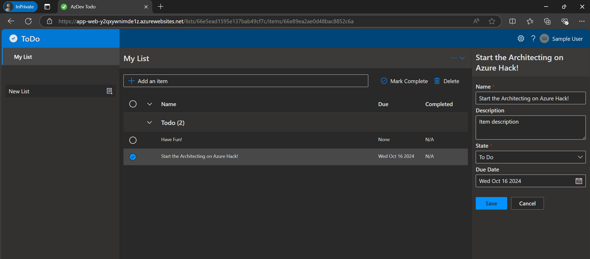

# Chapter 0 - Start Architecting

## Building a TODO Application using Azure

This guide will help you build a simple TODO application where users can add and complete TODO items. We'll break down the process into three key pillars of architecture: Compute, Storage, and Connectivity.

### 1. Compute: Hosting Your Application

First, your app needs to be hosted. Azure offers various compute options, and you can choose the most suitable one using the following decision tree: [Choose an Azure compute service](https://learn.microsoft.com/en-us/azure/architecture/guide/technology-choices/compute-decision-tree).

### 2. Storage: Storing TODO Items

Once users enter TODO items, these need to be stored. We'll use [**Azure Cosmos DB API for MongoDB**](https://docs.microsoft.com/azure/cosmos-db/mongodb/mongodb-introduction) for this purpose in the next chapter. To explore other storage options on Azure, refer to [Review your storage options](https://learn.microsoft.com/en-us/azure/architecture/guide/technology-choices/storage-options) & [Databases on Azure](https://azure.microsoft.com/en-us/products/category/databases/?msockid=2508f470901c684f1c68e76491fc69d9).

### 3. Connectivity: Connecting Components

In the later tasks, we will focus on the connectivity between the deployed resources and enhance the architecture with additional networking resources.

💡 **Learning Resources**: 
- [Azure networking services overview](https://learn.microsoft.com/en-us/azure/networking/fundamentals/networking-overview)
- [Azure Networking Fundamentals Documentation | Microsoft Learn](https://learn.microsoft.com/en-us/azure/networking/fundamentals/)

### Additional Components

Furthermore, you will also need:
- **Monitoring:** Implement monitoring solutions to track the performance and health of your application.
- **Security:** Incorporate security measures to protect your application and data.

**| [next Chapter 1 - Select an Architecture >](../chapter-1/README.md)**