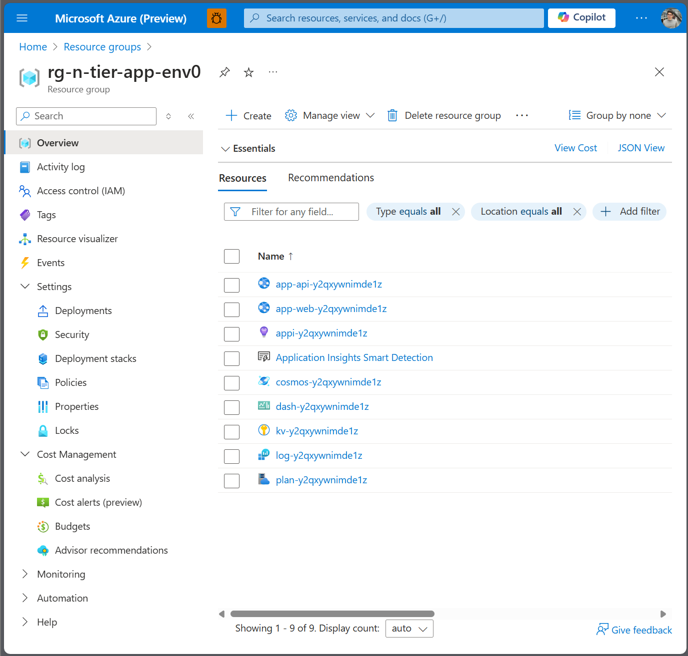
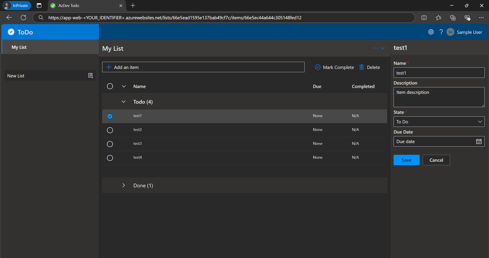

# Chapter 2 - Deploy the resources using the blueprint

### Prerequisites
> This template will create infrastructure and deploy code to Azure. If you don't have an Azure Subscription, you can sign up for a [free account here](https://azure.microsoft.com/free/). Make sure you have contributor role to the Azure subscription.


The following prerequisites are required to use this application. Please ensure that you have them all installed locally.

- [Azure Developer CLI](https://aka.ms/azd-install)
- [Python (3.8+)](https://www.python.org/downloads/) - for the API backend
- [Node.js with npm (18.17.1+)](https://nodejs.org/) - for the Web frontend
- [Terraform CLI](https://aka.ms/azure-dev/terraform-install)
    - Requires the [Azure CLI](https://learn.microsoft.com/cli/azure/install-azure-cli)

### Quickstart
To learn how to get started with any template, follow the steps in [this quickstart](https://learn.microsoft.com/azure/developer/azure-developer-cli/get-started?tabs=localinstall&pivots=programming-language-python) with this template(`Azure-Samples/todo-python-mongo-terraform`).

## Task 1 - Initialize the environment

- Initialize the environment

Run the following Terminal Command in the directory

    azd init -t todo-python-mongo-terraform

You will be prompted to enter a name for your environment:

```azd
? Enter a new environment name: [? for help]
```

```azd
? Enter a new environment name: <name_of_your_environment>

SUCCESS: New project initialized!
```

[React Web App with Python API and MongoDB - Terraform](https://github.com/Azure-Samples/todo-python-mongo-terraform)

### Review the Resources to be Deployed

Navigate to the **\infra** folder and open the **main.tf** file. This file defines the infrastructure to be deployed using [Infrastructure as Code (IaC)](https://learn.microsoft.com/en-us/devops/deliver/what-is-infrastructure-as-code) in Terraform language.

- **Modules**: Review the modules specified within the **main.tf** file.
- **Terraform Files**: Examine other relevant Terraform files such as **variables.tf** and **provider.tf** to understand the configuration details.
- **Additional Modules**: Additional modules can be found in the **\infra\modules** folder.

### Examine the Application Code

The application code for the API and web components can be found in the following directories:
- **API**: `src\api`
- **Web**: `src\web`

 ## Success criteria

- You have successfully setup the project and reviewed the infrastructure as TerraForm code.

## Task 2 - Provision the resources

📘 How-To Guide: [Get started using Azure Developer CLI | Microsoft Learn](https://learn.microsoft.com/en-us/azure/developer/azure-developer-cli/get-started?tabs=localinstall&pivots=programming-language-nodejs)

Run the ``azd auth login`` command and azd launches a browser for you to complete the sign-in process:

    azd auth login

Provision and deploy the resources to Azure. Run the following command:

    azd up

 Select your training subscription - Terminal Input:

```azd
? Select an Azure Subscription to use:  [Use arrows to move, type to filter]
```

Select ``germanywestcentral`` or ``South Africa North`` as region - Terminal Input: 

```azd
? Select an Azure location to use:  [Use arrows to move, type to filter]
```
Next you will see the TerraForm is initialized and TerraForm commands will be applied. This step could take up to 15min.

```azd
...
Terraform has been successfully initialized!
...
Terraform used the selected providers to generate the following execution plan. Resource actions are indicated with the following symbols:
  + create

Terraform will perform the following actions:

<RESOURCES TO DEPLOY AS IaC>
```
**Terraform Apply Command**

During the execution of the `terraform apply` command, you will see the outputs of TerraForm deployment.

Review the deployment progress on Azure Portal.
- Open the [Azure Portal](https://portal.azure.com/#home).
- Find your resource group with your environment name.



```azd
Apply complete! Resources: 26 added, 0 changed, 0 destroyed.

Outputs:

API_BASE_URL = "https://app-api-<WEBSITE_URI>.azurewebsites.net"
APPLICATIONINSIGHTS_CONNECTION_STRING = <sensitive>
AZURE_COSMOS_CONNECTION_STRING_KEY = "AZURE-COSMOS-CONNECTION-STRING"
AZURE_COSMOS_DATABASE_NAME = "Todo"
AZURE_KEY_VAULT_ENDPOINT = <sensitive>
AZURE_LOCATION = "germanywestcentral"
REACT_APP_WEB_BASE_URL = "https://app-web-y2qxywnimde1z.azurewebsites.net"
SERVICE_API_ENDPOINTS = tolist([])
USE_APIM = false

Deploying services (azd deploy)

  |   ====| Deploying service api (Uploading deployment package)
```

When the deployment of the Web Application and API is finished you will see the endpoints to both resources.

 - Use the second endpoint ``https://<WEB_URL>.azurewebsites.net/`` from your terminal output to access your application.

```azd
Deploying services (azd deploy)

  (✓) Done: Deploying service api
  - Endpoint: https://<API_ENDPOINT>.azurewebsites.net/

  (✓) Done: Deploying service web
  - Endpoint: https://<WEB_URL>.azurewebsites.net/

SUCCESS: Your up workflow to provision and deploy to Azure completed in 10 minutes 14 seconds.
```
Browse through the application and add TODO items:



## Success Criteria 🎉

- 🎊 **Congratulations!** You have successfully deployed the resources and the web application.
- ✅ **TODO Application** The application is up and working!

 **[< previous chapter 1 - Select an Architecture](../chapter-1/README.md) | [next chapter 3 - Monitor the resources >](../chapter-3/README.md)**