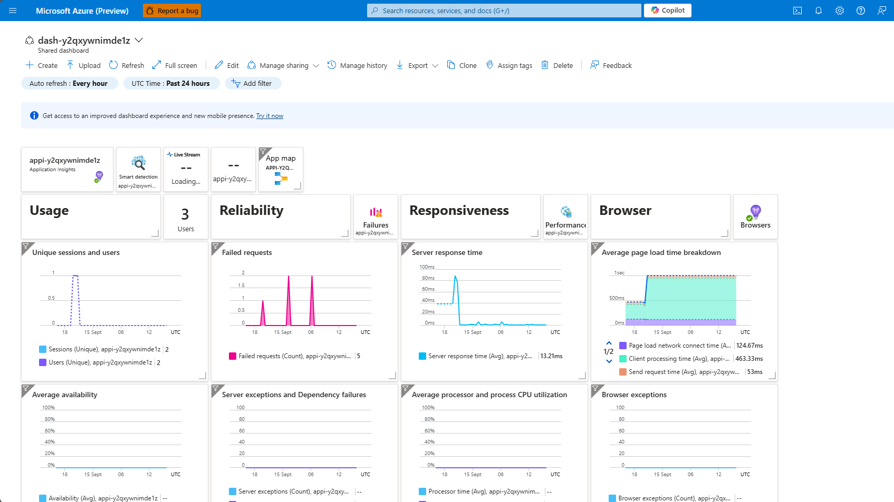
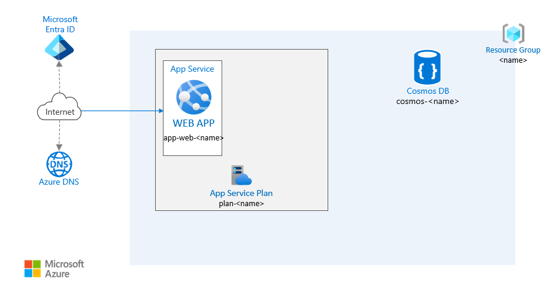

# Chapter 3 - Monitor the resources

## Task 1 - Open the Application Insights dashboard

- Use [`azd monitor`](https://learn.microsoft.com/azure/developer/azure-developer-cli/monitor-your-app) to monitor the application 

Run the following Terminal Command in the directory

    azd monitor

## Task 2 - Navigate through the metrics

Navigate to the Application Insights dashboards:
- overview
- live metrics
- logs

## Success Criteria

- Successfully execute the ``azd monitor`` command.
- Navigate and review the Application Insights dashboards.

## 💡 Architecture Checkpoint - Drawing - Create an Architecture Diagram

In this checkpoint, you will create an architecture diagram for your web app, including the newly deployed resources.

### Templates

- Start with the [empty template](../app-service-architecture-webapp-empty.vsdx).

- 🖼️ [Azure Resource Icons](https://learn.microsoft.com/en-us/azure/architecture/icons/)

Not everyone enjoys drawing; if you'd prefer to skip this part, you can use the provided solution template [here](../app-service-reference-architecture-webapp.vsdx) and adjust the values as needed.

## Steps to Follow

### 1. Open Visio

- Begin with the template [here](../app-service-architecture-webapp-empty.vsdx) or create your own from scratch.
- Extend the toolbar on the left and search for icons representing Azure resources.

### 2. Add the Following Resources to the Architecture Diagram

- [**Azure App Services**](https://docs.microsoft.com/azure/app-service/): WEB APP `app-web-`
- [**Azure App Service**](https://docs.microsoft.com/azure/app-service/): API `app-api-`
- [**Azure App Service Plan**](https://docs.microsoft.com/azure/app-service/): App Service Plan including both App Services `plan-`
- [**Cosmos DB**](https://docs.microsoft.com/azure/cosmos-db/mongodb/mongodb-introduction): `cosmos-`
- [**Log Analytics Workspace**](https://docs.microsoft.com/azure/azure-monitor/): `log-`
- [**Key Vault**](https://docs.microsoft.com/azure/key-vault/): `kv-`

### 3. Draw the Connections Between Them

- Use arrows to indicate connectivity between components.
- Set the arrows to bidirectional under `Home > Line > Arrows`.

## SOLUTIONS

[SOLUTION EXAMPLE - ARCHITECTURE](../app-service-reference-architecture-webapp.vsdx)

[SOLUTION EXAMPLE - ARCHITECTURE IMAGE](solution/00_solution.png)

 **[< previous chapter 2](../chapter-2/README.md) | [next chapter 4 - Network Architecture - Organize the resources in VNET >](../chapter-4/README.md)**