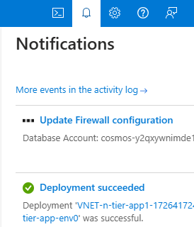
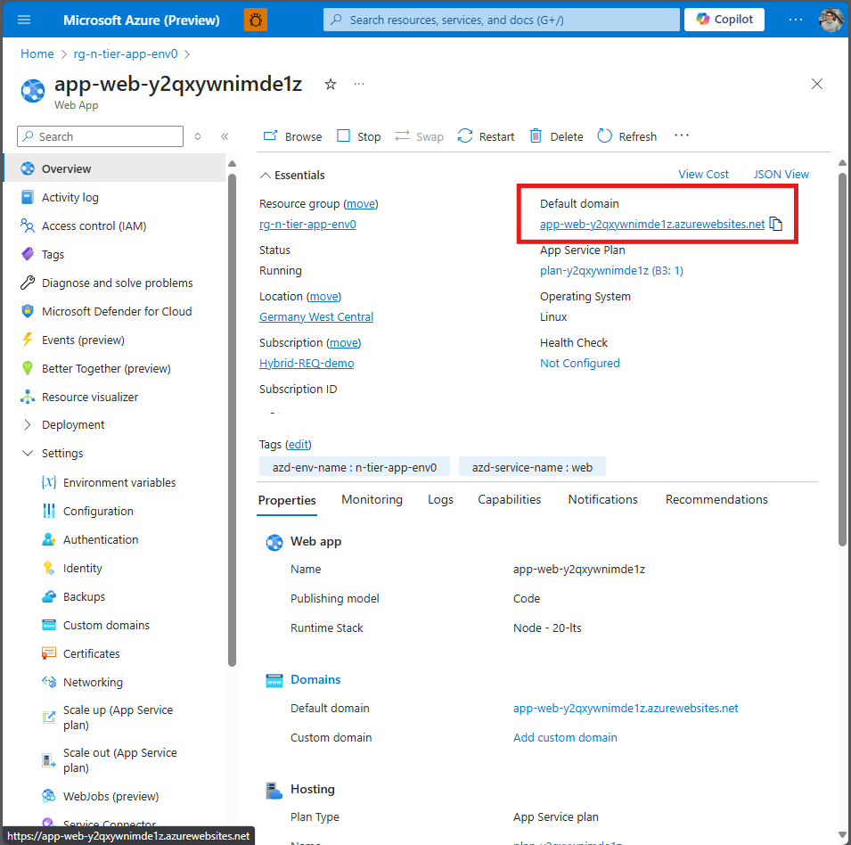
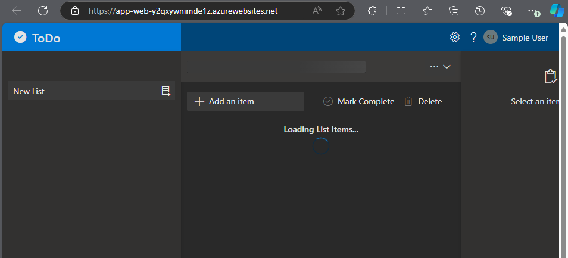
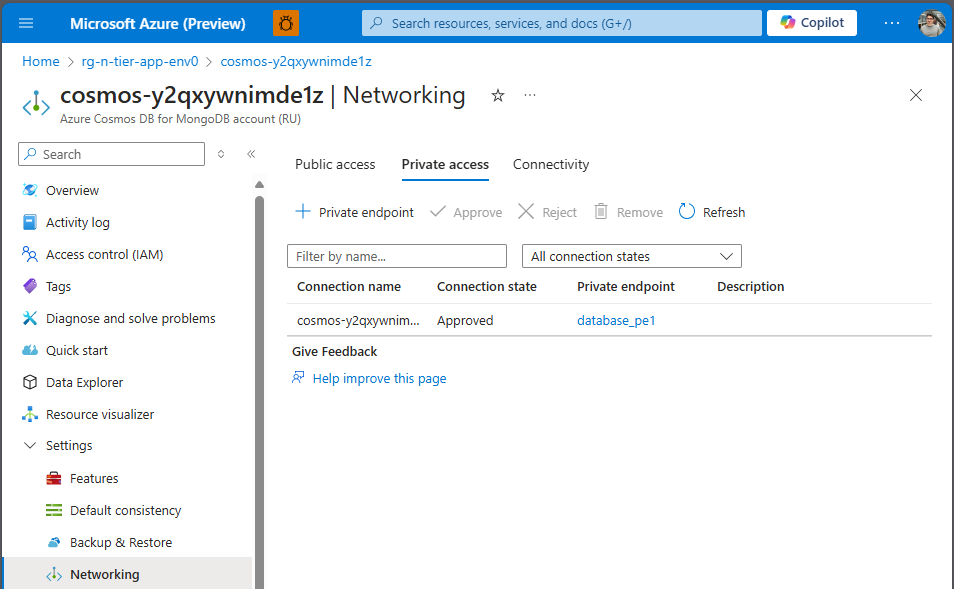

# Chapter 4 - Network Architecture - Organize the resources in VNET & Private Link

In this section, we will explore the connectivity within our architecture. Currently, our setup does not utilize any Virtual Networks (VNETs) and relies on the public internet. We will begin by organizing our resources into subnets to enhance our network architecture.

Up to this point, we have used Azure Developer CLI and Terraform to deploy the necessary resources. For this chapter, we will continue on the [Azure Portal](https://portal.azure.com/#home).

## Task 1 - Creating a Virtual Network

1. Open the [Azure Portal](https://portal.azure.com/#home).
2. Create a Virtual Network with 4 subnets.

📘 How-To Guide: [Create an Azure virtual network - Azure Virtual Network | Microsoft Learn](https://learn.microsoft.com/en-us/azure/virtual-network/manage-virtual-network#create-a-virtual-network)

* **default** 10.0.0.0/24
* **api** 10.0.1.0/24
* **database** 10.0.3.0/24
* **web_app** 10.0.2.0/24

## Task 2 - Securing Resources and Disabling Public Access

- Disable public access for the ``CosmosDB database``.

💡 Hint: How-to

 

Go to your "Azure Cosmos DB for MongoDB account (RU)" resource on Azure Portal.

Under the "Settings" Section you will find the "Networking" section.

Open the Networking section and set "Public network access" to "disabled". Click "Save" to update the firewall settings.

### Please Note:
The following process may take a few minutes to complete.

### Task 3 - Test the connection

Test the connection by browsing TODO items on the website

- Browse the application web site

Go to the application website and click on the website URL

Loading List Items...

> [!CAUTION]
> **Important**: You should not be able to browse the TODO items. As public access was disabled in the previous step, the Web API cannot establish a connection to the CosmosDB database.

As we disabled the **public access** to the database, the TODO items were not loading, causing the website to remain stuck on the loading screen. 
We need to re-establish the database connection. We will create a private link for this.

## Task 4 - Establish a private link between the Database and Web API
Secure the resources & ensure the connection to the Database through Private Links

### Task 4 a - Create a private endpoint to the CosmosDB Database

- Create a private endpoint to the MongoDB database

💡 Hint: How-to 1: Find Networking settings of the cosmosDB

 

Go to your "Azure Cosmos DB for MongoDB account (RU)" resource on Azure Portal.

Under the "Settings" Section you will find the "Networking" section.

Open the Networking section and click the tab "Private access".

💡 Hint: How-to 2: Create a Private Endpoint

 

Click "+ Private endpoint"

### Set the following parameters for the Private Endpoint.

📘 How-To Guide: [Configure Azure Private Link for Azure Cosmos DB | Microsoft Learn](https://learn.microsoft.com/en-us/azure/cosmos-db/how-to-configure-private-endpoints?tabs=arm-bicep)

**Basics**
* name

**Resource:**
* **Resource type:** *Microsoft.AzureCosmosDB/databaseAccounts*
* **Resource:** *\<cosmos database\>*
* **Target sub-resource:** ``MongoDB``

**Virtual Network**
* **Virtual Network:** ``\<VNET created in the previeous exercise\>``
* **Subnet:** ``default``

**DNS**

Integrate the private endpoint into the private DNS zone in order to ensure correct DNS resolution.

* **Integrate with private DNS zone**: *Yes*

Create the *private endpoint resource*.

> [!CAUTION]
> **Please Note**: This deployment may take a few minutes to complete.

## Success Criteria 🎉

- 🎊 **Congratulations!** You have successfully created a private endpoint to the database.

💡 **Learning Resources**: 
- [What is Azure Private Link? | Microsoft Learn](https://learn.microsoft.com/en-us/azure/private-link/private-link-overview)
- [What is Azure Private Link service? | Microsoft Learn](https://learn.microsoft.com/en-us/azure/private-link/private-link-service-overview)

For more information on managing virtual networks in Azure, refer to the official [Azure Virtual Network Documentation](https://docs.microsoft.com/en-us/azure/virtual-network/).

 **[< back](../chapter-3/README.md) | [next chapter 5 - Network Architecture - Secure the resources >](../chapter-5/README.md) | [solutions](solutions/README.md)** |