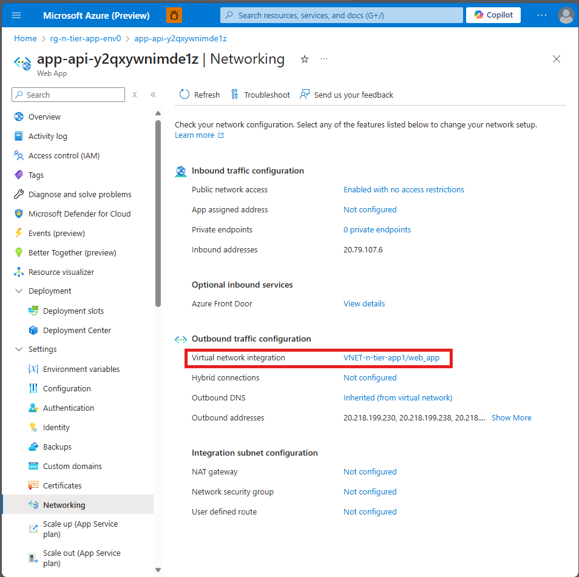
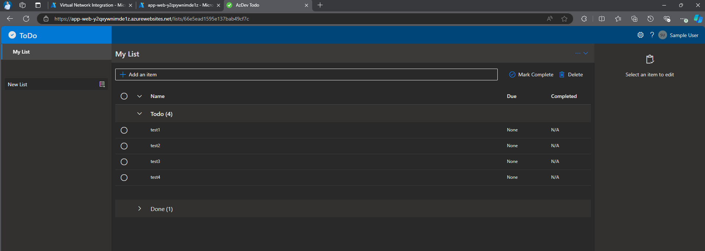
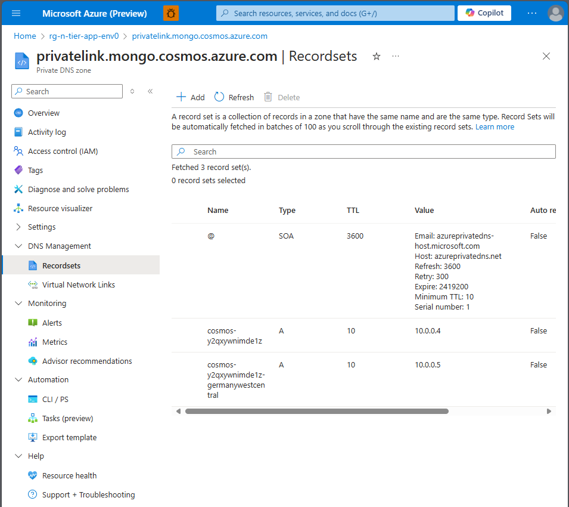
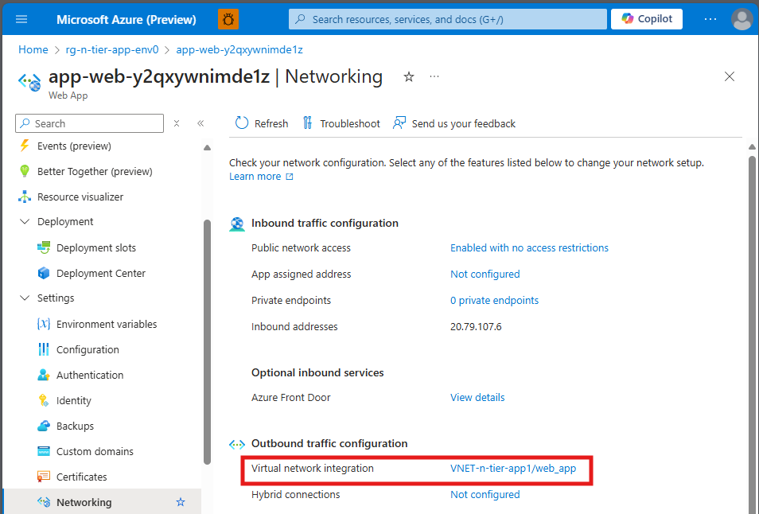

# Chapter 5 - Network Architecture - Secure the resources

## Organizing Resources into Subnets

We created our VNET with 4 different subnets:
* **default** ``10.0.0.0/24``
* **api** ``10.0.1.0/24``
* **database** ``10.0.3.0/24``
* **web_app** ``10.0.2.0/24``

- The tasks of this chapter is to integrate each resource into its corresponding subnet within the Virtual Network.

We will start with the Application API ( ``app-api-`` resource ).

## TASK 1: Web API -> ``api`` Subnet

- Go to the **Networking** settings of the Web API

💡 Hint: How-to 1: Find Networking settings of the API

 

Go to your Web App resource ( Web App resource starting with the prefix ``app-api-`` ) on Azure Portal.

Under the "Settings" Section you will find the "Networking" section.

Open the Networking section and under the tab "Outbound traffic configuration" find "Virtual network integration".

- Configure Virtual Network Integration

💡 Hint: How-to 2: Find Networking settings of the API

 

Open the Networking section. Under the tab "Outbound traffic configuration" find "Virtual network integration". Click on the text "not configured".

Add Virtual Network Integration. Refer to the following settings

Connect the API with the following configuration:

**Add virtual network integration**
* **Subscription:** ``[Your Subscription Name]``
* **Virtual Network:** ``\<VNET created in the previeous exercise\>``
* **Subnet:** ``api``

 ## Success criteria

- You have successfully integrated the Web App API into the VNET.

## TASK 2: Test the connection again

Test the connection by browsing TODO items on the website

- Browse the application web site

Go to the application website and click on the website URL

## Success Criteria 🎉

- 🎊 **Congratulations!** You have successfully re-established a connection to the database through a private endpoint.
- ✅ **TODO items are now loading again**, confirming that a private connection between the Web API and the database is ensured.

## 💡 Learning Checkpoint - DNS Resolution

In this checkpoint, you will review the DNS settings for a specific resource in your Azure environment.

## Steps to Follow:

1. **Navigate to Your Resource Group:**
   - Access the Azure portal.
   - Locate your resource group that contains the DNS resource.

2. **Find the DNS Resource:**
   - Within the resource group, look for the DNS resource named **privatelink.mongo.cosmos.azure.com**.

3. **Review A-records:**
   - Click on the DNS resource to open its details page.
   - Navigate to the **Record sets** section under **DNS Management**.
   - Examine the A-records listed there.

By following these steps, you will gain an understanding of the DNS resolution process for the specified resource.

💡 **Learning Resources**: 
[What is Azure Private DNS? | Microsoft Learn](https://learn.microsoft.com/en-us/azure/dns/private-dns-overview)

## TASK 3: Put the Web Site App into a Subnet

In this task, we will continue placing each resource into its respective subnet within the Virtual Network.

Repeat the same steps to integrate the **Web Site App resource** (resource with the prefix ``app-web-``) into the designated subnet.

### Add Virtual Network Integration

Integrate the **Web Site App resource** (resource with the prefix ``app-web-``) to the subnet *web_app* within the VNET.

1. Navigate to the **Web Site App resource** in your Azure portal.
2. Click on the **Networking** section.
3. Under **VNet Integration**, click **not configured**.
4. Configure the network integration with the following details:
   - **Subscription**: ``[Your Subscription Name]``
   - **Virtual Network**: ``[Select your VNET]``
   - **Subnet**: ``web_app``

5. Save the configuration.

## Success Criteria 🎉

- 🎊 **Congratulations!** You have successfully integrated Web Site App and API to its subnets!

## 💡 Architecture Checkpoint - Drawing - Update the Architecture Diagram

In this checkpoint, you will update the architecture diagram to include the network resources.

## Instructions

1. **Template**
   - Begin with your [template from previous exercise](../app-service-reference-architecture-webapp.vsdx).

2. **Update the Diagram**
   - Add the following network resources to the diagram:
     - **Virtual Network**
       - Subnet: `web_app`
       - Subnet: `api`
       - Subnet: `database`
       - Subnet: `default`
     - **Private Endpoint**
     - **DNS Zone**

## Additional Notes
- Ensure each subnet is correctly labeled and positioned within the Virtual Network.
- Verify that connections between resources are logically represented.

## SOLUTIONS

[SOLUTION EXAMPLE - ARCHITECTURE](solutions/app-service-reference-architecture-webapp-vnets.vsdx)

[SOLUTION EXAMPLE - ARCHITECTURE IMAGE](solutions/00_solution_template.png)

 **[< Chapter 4 - Network Architecture](../chapter-4/README.md) | [next Chapter 6 - Azure Key Vault - RBAC Permissions >](../chapter-6/README.md) | [solutions](solutions/README.md)** |