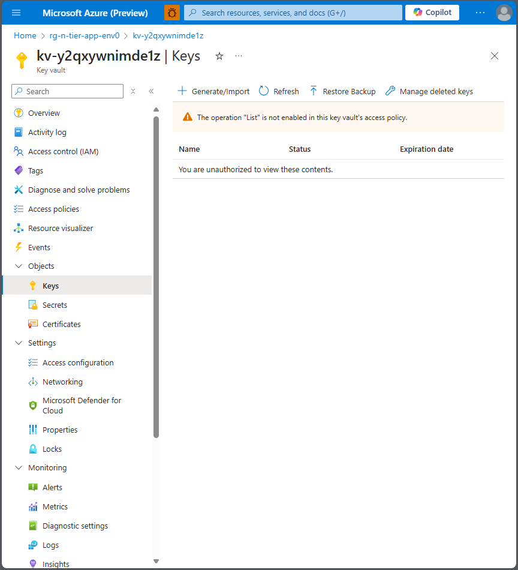
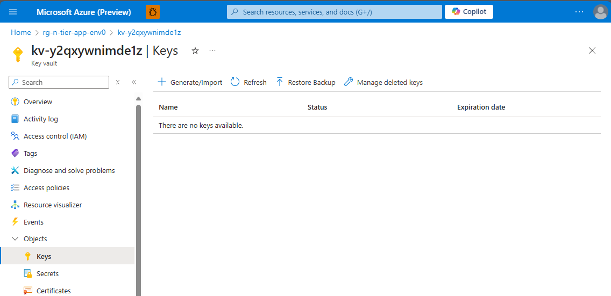

# Chapter 6 - Azure Key Vault - RBAC Permissions

In this chapter, your task is to explore and identify the Keys and Secrets stored in the environment. Typically, these are secured within a Key Vault.

## TASK 1: Access the Key Vault instance and identify the stored Keys

💡 Hint: How-to

 

Go to your "Key vault" ``kv-`` resource on Azure Portal.

Under the "Objects" Section you will find the "Keys" section.

Open the Keys section to list/view the Keys there.

> [!CAUTION]
> **Important**: The operation "List" is not enabled in this key vault's access policy.

As you attempt to access the Keys, you will notice that you do *not* have the necessary permissions to view them. The next task is to grant the required permissions to yourself.

## TASK 2: Grant "Get" and "List" Key Permissions to yourself

* Create a new access policy

📘 How-To Guide: [Assign an Azure Key Vault access policy (Portal) | Microsoft Learn](https://learn.microsoft.com/en-us/azure/key-vault/general/assign-access-policy?tabs=azure-portal)

Select **Get** and **List** Operations for the access

**You have two options:** You can assign the selected Permissions 
* to a *User* under **Principal** 
or 
* to an **Application**.

You can add yourself as *User* under **Principal** and assign the selected permissions.

### TASK 3: Review the keys again

Now that you have been granted the necessary permissions, revisit the Key Vault to review the stored Keys.

You should now be able to see the *Keys* in the Key Vault.

## Success Criteria 🎉

- 🎊 **Congratulations!** You have successfully granted key view permissions to yourself, but **no keys were stored there :(**

## TASK 4: Review the application permissions

In addition to user permissions, applications can also have specific permissions to access resources within the Key Vault. For instance, our **N-tier App** might be configured with permissions to retrieve secrets, which are then used by the application.

In this task, we will review the permissions that the N-tier application has to the Key Vault.

1. Navigate to the Key Vault instance and find the N-tier application API ``app-api-`` in the access policies.
2. Review the permissions assigned to the N-tier application. Ensure that it has the necessary permissions to perform its tasks, such as "Get" and "Set" for secrets.

By reviewing and understanding the permissions of our N-tier App, you'll gain insight into its access level and how it interacts with the Key Vault.

## Task 5 - Securing Resources and Disabling Public Access

- TODO: Disable public access for the keyvault.

📘 How-To Guide: [How to configure Azure Key Vault networking configuration | Microsoft Learn](https://learn.microsoft.com/en-us/azure/key-vault/general/how-to-azure-key-vault-network-security?tabs=azure-portal)

💡 Hint: How-to

 

Go to your "Key vault" resource on Azure Portal.

Under the "Settings" Section you will find the "Networking" section.

Open the Networking section and set "Public network access" to "disabled". Click "Save" to update the firewall settings.

### Task 6 - Create a private endpoint to the Key Vault

- Create a private endpoint to the Key Vault resource

📘 How-To Guide: [Integrate Key Vault with Azure Private Link | Microsoft Learn](https://learn.microsoft.com/en-us/azure/key-vault/general/private-link-service?tabs=portal)

💡 Hint: How-to 1: Find Networking settings of the Key Vault

 

Go to your "Key vault" resource on Azure Portal.

Under the "Settings" Section you will find the "Networking" section.

Open the Networking section and click the tab "Private endpoint connections".

💡 Hint: How-to 2: Create a Private Endpoint

 

Click "+ Create" under the Tab tab "Key Vault > Networking > Private endpoint connections"

### Set the following parameters for the Private Endpoint:

**Basics**
* name

**Resource:**
* **Resource type:** *Microsoft.KeyVault/vaults*
* **Resource:** *\<key vault ky- \>*
* **Target sub-resource:** *vault*

**Virtual Network**
* **Virtual Network:** *\<VNET created in the previeous exercise\>*
* **Subnet:** *default*

**DNS**

Integrate the private endpoint into the private DNS zone in order to ensure correct DNS resolution.

* **Integrate with private DNS zone**: *Yes*

Create the *private endpoint resource*.

## Success Criteria 🎉

- 🎊 **Congratulations!** You have successfully created a private endpoint to the key vault.

 **[< previous Chapter 5 - Network Architecture - Secure the resources](../chapter-5/README.md) | [next chapter 7 - Reverse Engineering >>](../chapter-7/README.md) |**