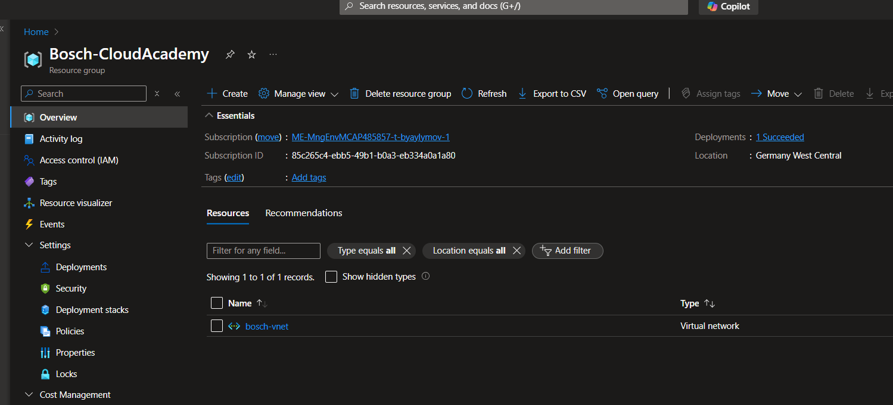
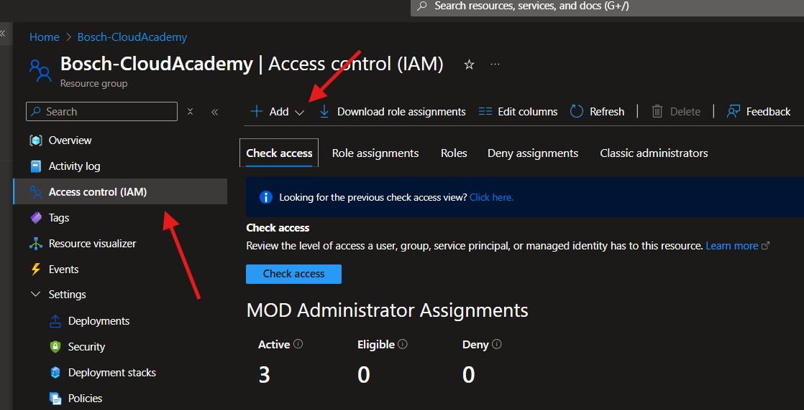
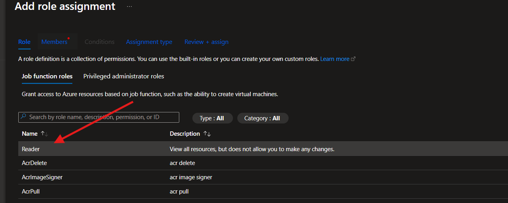
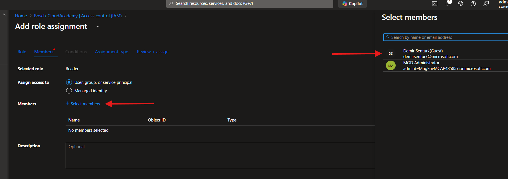
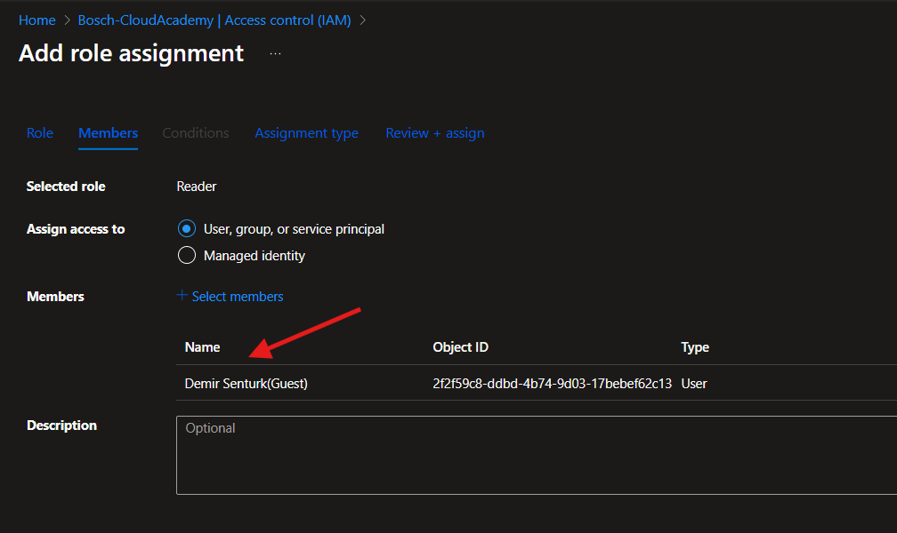
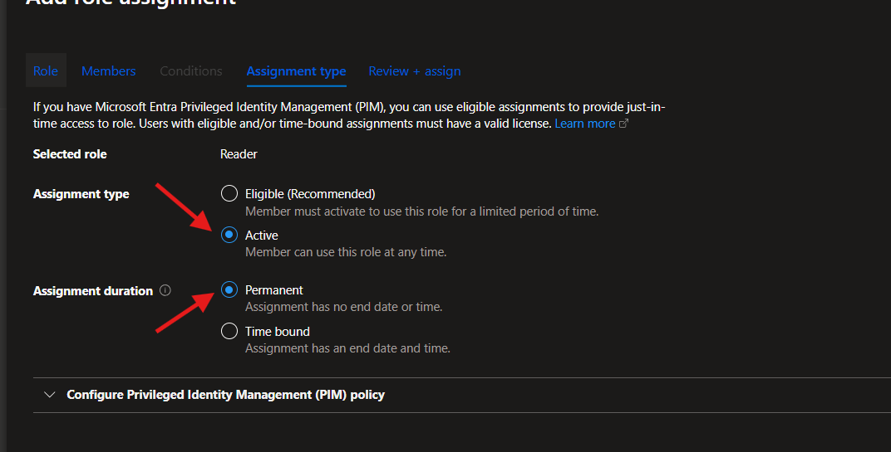
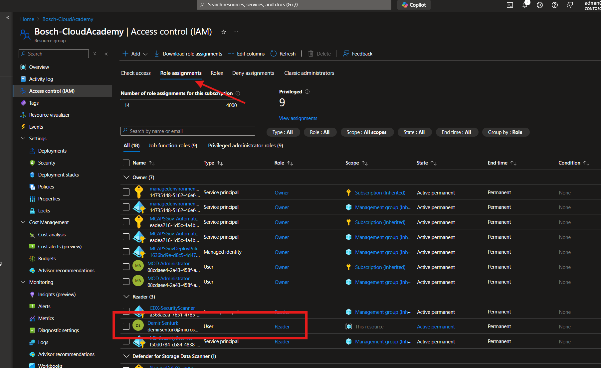

# Solutions Chapter 1 - Lab: VNet, VMs and Azure Portal

## RBAC Tutorial

This is the scope of resources that the access applies to:

1. Select the resource (e.g., a Virtual Machine or Resource Group) for which you want to assign a role.

2. Go to the **Access control (IAM)** section.
3. Click **Add** > **Add role assignment**.

4. Select a role (e.g., "Reader" or "Contributor").

5. Click **Select members** > Assign the role to a user, group, or service principal.

6. After you have selected, you will see this screen:

7. Check assignment types. Make it Active, so that the user can use it anytime.

8. Click **Review + assign** and verify the role assignment.

## Terraform  Overview

This Terraform configuration sets up basic Azure infrastructure, including a resource group, a virtual network, a subnet, and a network interface. It's designed to provide a simple example of how to use Terraform to manage Azure resources and to click through the resources in the Azure Portal for showcasing purposes.

## Prerequisites

- An Azure account
- [Terraform](https://www.terraform.io/downloads.html) installed on your local machine
- [Azure CLI](https://docs.microsoft.com/en-us/cli/azure/install-azure-cli) installed on your local machine

## Configuration Details

- **Resource Group**: A resource group named `example-resources` located in `West Europe`.
- **Virtual Network**: A virtual network named `example-vnet` with an address space of `10.0.0.0/16`.
- **Subnet**: A subnet named `example-subnet` within the virtual network with an address prefix of `10.0.1.0/24`.
- **Network Interface**: A network interface named `example-nic` associated with the subnet.
- **Public IP Address**: A public IP address named `example-public-ip` associated with the network interface.

## Deployment Steps

1. Clone this repository to your local machine.
2. Open a terminal window and navigate to the root of the cloned repository.
3. Run `az login` to authenticate with your Azure account.
4. Run `terraform init` to initialize the Terraform configuration.
5. Run `terraform plan` to view the resources that will be created.
6. Run `terraform apply` to create the resources.
7. Run `terraform destroy` to delete the resources when you're done.
8. Run `az logout` to log out of your Azure account.

## Continue

**[< back to Chapter](../../chapters/chapter-1/README.md) | [home](../../README.md)**
